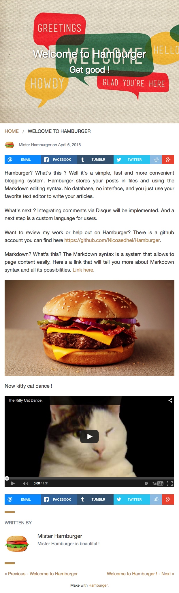

# Welcome to Hamburger !

Hamburger? What's this ? Well it's a simple, fast and more convenient blogging system. Hamburger stores your posts in files and using the Markdown editing syntax. No database, no interface, and you just use your favorite text editor to write your articles.

What's next ?
Integrating comments via Disqus will be implemented. And a next step is a custom language for users.

Want to review my work or help out on Hamburger? There is a github account you can find here [https://github.com/Nicoaedhel/Hamburger](https://github.com/Nicoaedhel/Hamburger).

Markdown? What's this?
The Markdown syntax is a system that allows to page content easily. Here's a link that will tell you more about Markdown syntax and all its possibilities.[http://daringfireball.net/projects/markdown/syntax#link](http://daringfireball.net/projects/markdown/syntax#link) .

